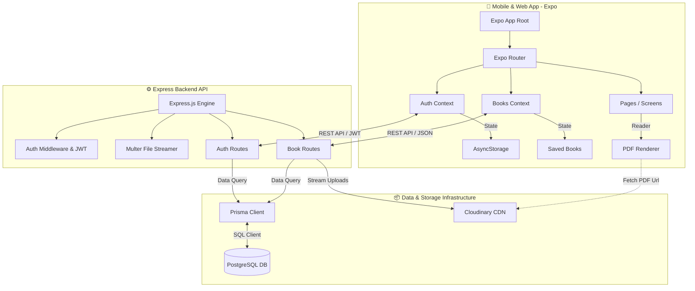

# 📚 CPM Library App (CRM Library)

Welcome to the **CPM Library App** (internal code name: `crm-library`). This is a state-of-the-art cross-platform mobile and web application designed to act as a digital library for scripture school textbooks, periodical publications, and theological literature. 

It provides an intuitive reading experience with offline bookmarking, in-app PDF viewing, and an advanced administration portal for uploading and managing literary materials.

---

## 🏗️ System Architecture

This project is built using a modern **Client-Server-Database-Cloud** decoupled architecture. It provides high performance, ease of deployment, and a seamless native experience across iOS, Android, and Web platforms.



### 1. Frontend Architecture
* **Framework**: React Native with **Expo SDK 54** (Universal App).
* **Navigation & Routing**: [Expo Router](file:///e:/Project/FAITE%20Projects/CPM%20Library/cpm-library/app) utilizing file-based routing. Highlights include:
  * **User Area (Tabs)**: Home list, explore/filter tabs, favorites, settings.
  * **Admin Portal**: Admin Dashboard, upload screen, metadata tables.
* **Styling & Layout**: **NativeWind (Tailwind CSS for React Native)** for a unified design system.
* **State Management**:
  * [AuthContext.tsx](file:///e:/Project/FAITE%20Projects/CPM%20Library/cpm-library/context/AuthContext.tsx): Manages sessions, registration, login states, and stores tokens in `AsyncStorage`.
  * [BooksContext.tsx](file:///e:/Project/FAITE%20Projects/CPM%20Library/cpm-library/context/BooksContext.tsx): Manages scripture books, voice books, and bookmarks (saved books) globally.
* **PDF Reader**: Custom [pdf-viewer.tsx](file:///e:/Project/FAITE%20Projects/CPM%20Library/cpm-library/app/pdf-viewer.tsx) and [pdf-viewer.web.tsx](file:///e:/Project/FAITE%20Projects/CPM%20Library/cpm-library/app/pdf-viewer.web.tsx) featuring a native render wrapper based on `react-native-pdf`.

### 2. Backend Architecture
* **Server Framework**: Node.js & Express.js ([server/index.js](file:///e:/Project/FAITE%20Projects/CPM%20Library/cpm-library/server/index.js)).

* **ORM & Database**: **Prisma ORM** mapping onto a **PostgreSQL** relational database.

* **Authentication**: Password hashing with **bcryptjs** and session security with **JWT (JSON Web Tokens)**.

* **Media Management**: **Multer** intercepts file uploads in-memory, streaming them directly to **Cloudinary** (Cloud Storage CDN) for optimal asset delivery without clogging server disk space.

---

## 📂 Project Directory Structure

Below is the directory map highlighting core folders and entry points.

```bash
cpm-library/
├── 📱 app/                    # Expo Router App Entry & Screens
│   ├── (tabs)/                # Main Tab Bar Screens (Home, Explore, Favorites, Settings)
│   │   ├── index.tsx          # Home Feed Screen
│   │   ├── explore.tsx        # Search/Filter Categories
│   │   ├── favorites.tsx      # Saved Books Screen
│   │   └── settings.tsx       # User Settings Screen
│   ├── admin/                 # Administration Dashboards
│   │   ├── index.tsx          # Dashboard Portal
│   │   ├── upload.tsx         # Add Book Form (Cover Image & PDF upload)
│   │   └── manage-books.tsx   # Manage Scripture Materials
│   ├── _layout.tsx            # App Entry Setup, Providers & Route Registry
│   ├── login.tsx              # Account Login Screen
│   └── pdf-viewer.tsx         # Document Viewer (Native/Web wrapper)
├── 📦 components/             # Reusable UI Elements (Themed, Admin, Book Cards)
├── 🔗 context/                # React Context APIs
│   ├── AuthContext.tsx        # Authentication & AsyncStorage persistence
│   └── BooksContext.tsx       # Global Book Fetching, Uploading & Saving
├── 🗄️ server/                 # Express Backend API Codebase
│   ├── prisma/                # Database Migrations & Schemas
│   │   ├── schema.prisma      # PostgreSQL Schema Configuration
│   │   └── seed.js            # Initial Seed Script (Users and Books)
│   ├── routes/                # Express API Endpoints
│   │   ├── auth.js            # Authentication Endpoint handlers
│   │   └── books.js           # Books CRUD, file streaming & bookmarks
│   ├── index.js               # Express entrypoint & Middlewares
│   └── package.json           # Backend dependency configuration
├── 📄 package.json            # Frontend dependency configuration
└── 📄 README.md               # You are here!
```

---

## 🗄️ Database Design (Prisma)

The application revolves around 5 core tables mapped in [schema.prisma](file:///e:/Project/FAITE%20Projects/CPM%20Library/cpm-library/server/prisma/schema.prisma):

| Model Name | Table Name (`@@map`) | Description | Key Attributes |
| :--- | :--- | :--- | :--- |
| **User** | `users` | System users & administrators | `id`, `email`, `password`, `role` (`USER`/`ADMIN`), `memberId` |
| **ScriptureBook** | `scripture_books` | Scripture school books sorted by Grades | `id`, `title`, `grade`, `imageUri`, `fileUrl`, `category` |
| **VoiceBook** | `voice_books` | Voice of Pentecost monthly periodicals | `id`, `title`, `month`, `year`, `imageUri`, `fileUrl`, `isNew` |
| **PentecostBook** | `pentecost_books` | General Pentecost theological books | `id`, `title`, `author`, `languages` (Array), `imageUri`, `fileUrl` |
| **SavedBook** | `saved_books` | Join-table handling bookmarks/saves | `id`, `userId` ➡️ `User.id`, `bookId`, `bookType` |

---

## 🚀 Setup & Execution Guide

Follow these steps to set up and run both the Express backend API and the React Native Expo app.

### 🔌 Step 1: Pre-requisites & Environment Setup
Make sure you have **Node.js** (v18+) and a **PostgreSQL** instance running.

#### 1. Server Configuration
Create a `.env` file in the [server/](file:///e:/Project/FAITE%20Projects/CPM%20Library/cpm-library/server) directory:
```env
# Database Connections
DATABASE_URL="postgresql://postgres:<your_password>@localhost:5432/cpm_library?schema=public"

# Express Server Configuration
PORT=5000
JWT_SECRET="your-development-jwt-super-secret-key"

# Cloudinary Storage Credentials
CLOUDINARY_CLOUD_NAME="dmpcab10q"
CLOUDINARY_API_KEY="773142274969342"
CLOUDINARY_API_SECRET="your_cloudinary_secret"
```

#### 2. Mobile App Configuration
Create a `.env` file in the root directory (already configured with local defaults):
```env
EXPO_PUBLIC_API_URL=http://localhost:5000/api
EXPO_PUBLIC_BASE_URL=http://localhost:5000
```
> [!IMPORTANT]
> **Mobile Device Gotcha**: If you run the app on a physical phone via **Expo Go**, replace `localhost` with your machine's **local IP address** (e.g., `http://192.168.1.15:5000/api`) so the phone can reach the local API server over Wi-Fi.

---

### ⚙️ Step 2: Initialize & Start Backend API
Open a terminal in the [server/](file:///e:/Project/FAITE%20Projects/CPM%20Library/cpm-library/server) directory and run:

```bash
# 1. Navigate to the server folder
cd server

# 2. Install backend dependencies
npm install

# 3. Compile Prisma Client, push schema to PostgreSQL, and seed initial database
npm run db:setup

# 4. Start the backend development server (via nodemon)
npm run dev
```

> [!TIP]
> The seed script [seed.js](file:///e:/Project/FAITE%20Projects/CPM%20Library/cpm-library/server/prisma/seed.js) initializes the database with clean mock books, scripture textbooks, and predefined login credentials.

---

### 📱 Step 3: Start Frontend Mobile App
Open a second terminal window in the root directory:

```bash
# 1. Install mobile project dependencies
npm install

# 2. Start the Expo bundler
npx expo start
```

#### Interactive Commands:
* Press **`w`** to launch the web client immediately in your default browser.
* Press **`a`** to open the app on a connected Android Emulator.
* Press **`i`** to open the app on a connected iOS Simulator.
* Scan the QR code with **Expo Go** on your physical iOS or Android phone to test native features.

---

## 🔑 Pre-seeded Login Credentials

The [seed.js](file:///e:/Project/FAITE%20Projects/CPM%20Library/cpm-library/server/prisma/seed.js) script pre-configures two users for instant testing. Feel free to use them to log into the application:

| Username / Email | Password | Role / Access Level | Features Enabled |
| :--- | :--- | :--- | :--- |
| **`admin`** | `test` | **ADMIN** | Access Admin Dashboard, upload publications, delete materials. |
| **`user`** | `test` | **USER** | Browse books, search/filter by grade, read PDFs, toggle saved bookmarks. |

---

> [!NOTE]
> For any assistance with system updates, environment credentials, or code refactoring, consult the project lead or submit an issue inside the development repo. Happy Coding! 🚀
